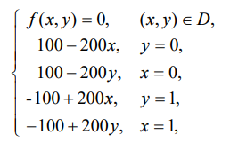

Был проведен эксперимент для задачи Дирихле из учебника   

Размер блока $BS = 32$ и точность решения $eps = 0.1$ взяты из учебника и зафиксированы в коде.

В табличке представлено время работы алгоритма в зависимсоти от количества о внутренних узлов в строке сетки (N) и количества потоков.
| N \ Threads| 1   | 4 | koef (1 vs 4)| 8 | koef (1 vs 8) |
|----------|----------|---|----------|----------|---|
| 100      | 0.051494 |0.0320627 | 1,6  | 0.0358108 | 1,44
| 200      | 0.236988 |0.109148  | 2,17 | 0.115017 | 2,06
| 300      | 0.562568 |0.227544 | 2,47  | 0.234935 | 2,39
| 500      | 1.63473  |0.606885 | 2,69 | 0.582053 | 2,81
| 1000     | 7.08137  |2.44965  | 2,89 | 2.17649 | 3,25
| 2000     | 29.9471  |10.5536  | 2,84 | 8.42467 | 3,55
| 3000     | 71.5433  |25.0132  | 2,86| 19.7687 | 3,62

Видно, что при маленьких сетках многопоточность дает меньший эффект, чем при больших. Это и логично - при маленьких сетках блок становится слишком большим и получается, что диагоналей пригодных к распараллеливанию не очень много. Как итог, коэффициент эффективности 8-и потоков растет при увеличение $N$ вплоть до значени $3.62$ при $N = 3000$, коэффициент эффективности 4-ех потоков также вначале растет, однако выходят на свой пик около $2.85$ уже при $N = 1000$,

ОС - Ubuntu 20.04.6 LTS, процессор - AMD Ryzen 5700U (8 физических ядер)
